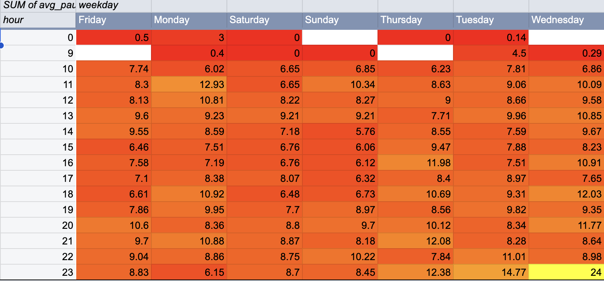
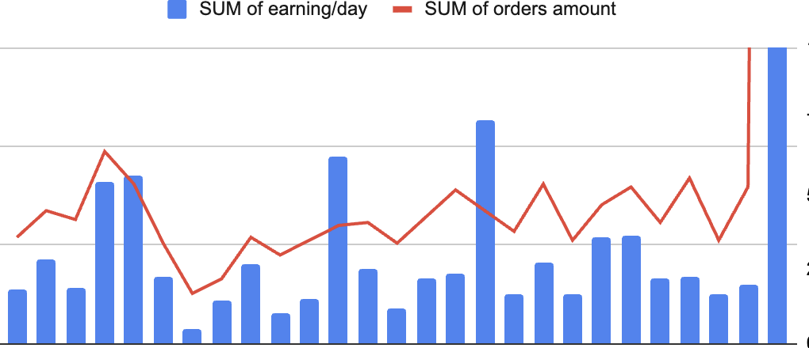
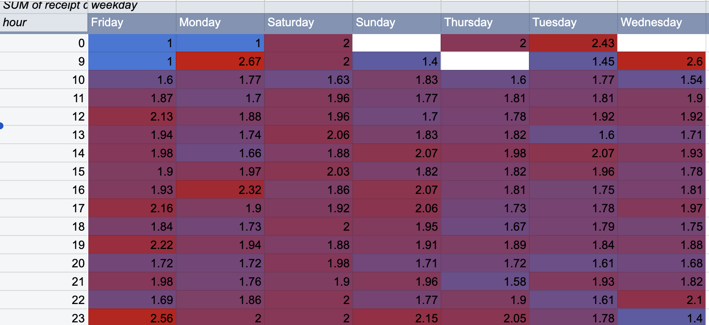
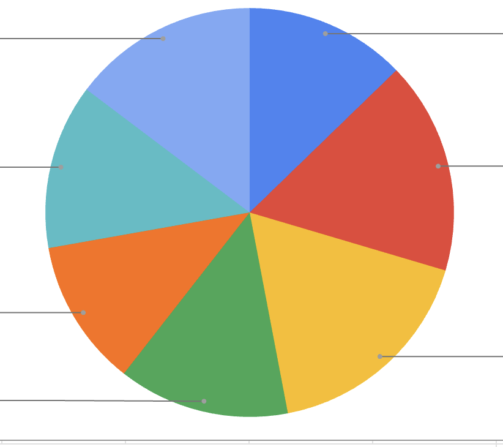

# Cafe Sales Analysis

## About the Project
This project aims to provide insights for cafe owners by identifying sales trends and performance patterns.

## Project Roadmap

1. **Data Cleaning:** Processing raw receipt data using Python (Pandas) and preparing it for export. DONE
2. **Database:** Designing the database schema and importing cleaned datasets into DBeaver. DONE
3. **Analysis:** Writing SQL queries to extract insights (revenue trends, ABC-analysis, etc.).
4. **Future Work**
* Глубокий анализ профилей постоянных клиентов (Customer Lifetime Value).
* ABC-анализ товарного ассортимента для оптимизации меню.

## Key Findings

* **Performance Analysis & Incentive Strategy:** Мы проанализировали эффективность бариста через показатели абсолютной выручки и общего количества заказов. 
    * *Вывод:* Есть лидеры эффективности. Для них требуется система мотивации, чтобы поддерживать высокую планку производительности на постоянной основе (избежать перепадов "то пусто, то густо"). 
    * *Рекомендация к собственнику:* Разработать KPI, привязанные не только к выручке, но и к стабильности показателей в течение всей смены.

* **Cross-selling Opportunities:** Анализ смен и продуктовой корзины показал, что часть персонала не использует потенциал кросс-продаж. 
    * *Рекомендация:* Внедрить стандарты активного предложения дополнительных товаров (food-pairing: кофе + десерт/выпечка), основываясь на данных о часах с низким средним чеком.

* **Operational Stability:** Коэффициент вариации подтверждает, что нагрузка на кофейню нестабильна (режим «шторма»). 

* **Driver of Complexity (The "Deep Receipt" Factor):** Пиковые нагрузки вызваны не столько количеством посетителей, сколько высокой **глубиной чека** (большим количеством позиций). 
    * *Рекомендация:* Оптимизировать процессы сборки заказов с высокой вариативностью товаров. Внедрить готовые «сеты» (кофе + десерт), что сократит время на принятие решения клиентом и время сборки заказа.

* **Peak Intensity Management:** Утренние часы будней (9:00) и выходные дни требуют особого режима готовности персонала. 
    * *Рекомендация:* Внедрение системы предзаказов или «быстрых сетов» для критических часов поможет снизить давление на бариста и сократить время ожидания клиентов.

## Project Visuals

### 1. Operational Rhythm & Heatmap

### 2. Revenue & Sales Patterns

### 3. Revenue Distribution

## Tech Stack

* **Python (Pandas):** Data cleaning and transformation.
* **SQL:** Data storage and analytical querying.
* **DBeaver:** Database management.
* **VS Code, Jupyter Notebook**
